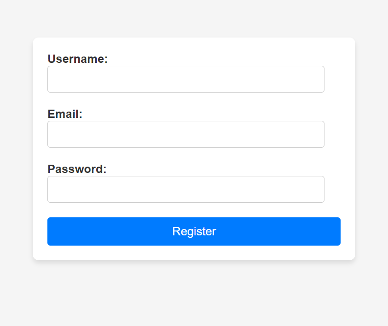

# Form-Creation-Validation

A simple **registration form with client-side validation**, built as part of my **ALX JavaScript assignment**.  
The project demonstrates how to capture user input, validate it with JavaScript, and provide real-time feedback to the user.

---

## 📌 Features

- User-friendly registration form
- Input validation for:
  - ✅ Username (minimum 3 characters)
  - ✅ Email (must contain `@` and `.`)
  - ✅ Password (minimum 8 characters)
- Prevents invalid form submission with `event.preventDefault()`
- Displays clear success or error messages
- Responsive design with basic styling

---

## 🚀 Live Demo

You can test the project here:  
👉 [Live Demo on GitHub Pages](https://kateykwesi.github.io/Form-Creation-Validation/)

---

## 🛠️ Built With

- **HTML5**
- **CSS3**
- **Vanilla JavaScript**

---

## 📸 Screenshot

---

## 📖 Assignment Note

This project was created as part of my **ALX Software Engineering (JavaScript) learning tasks**.  
It helped me practice DOM manipulation, event handling, and form validation.
